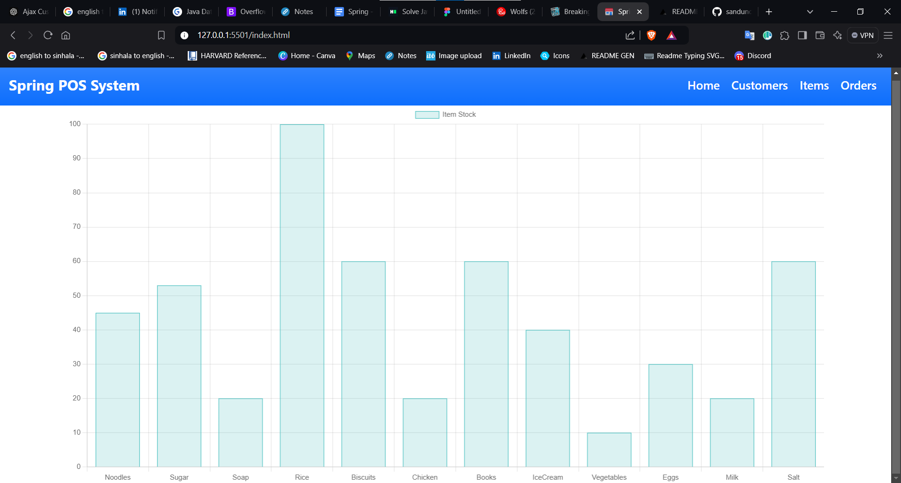
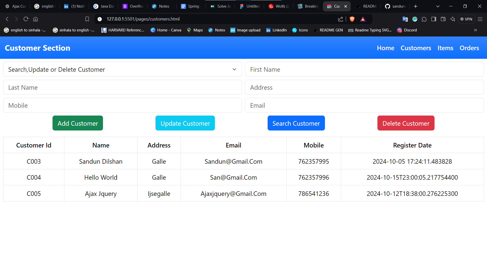
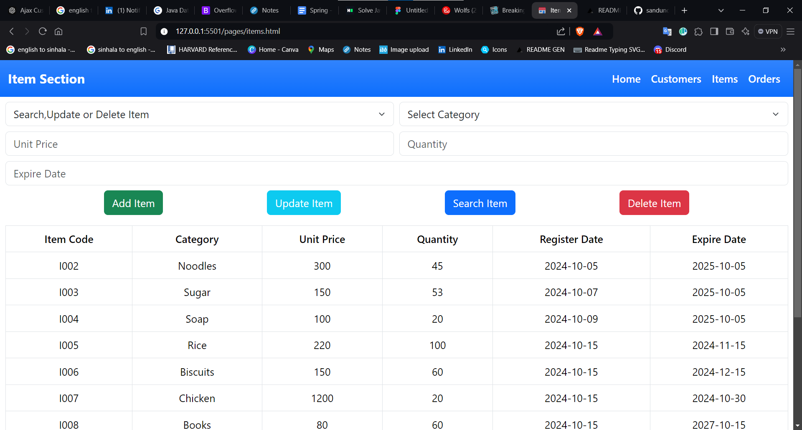
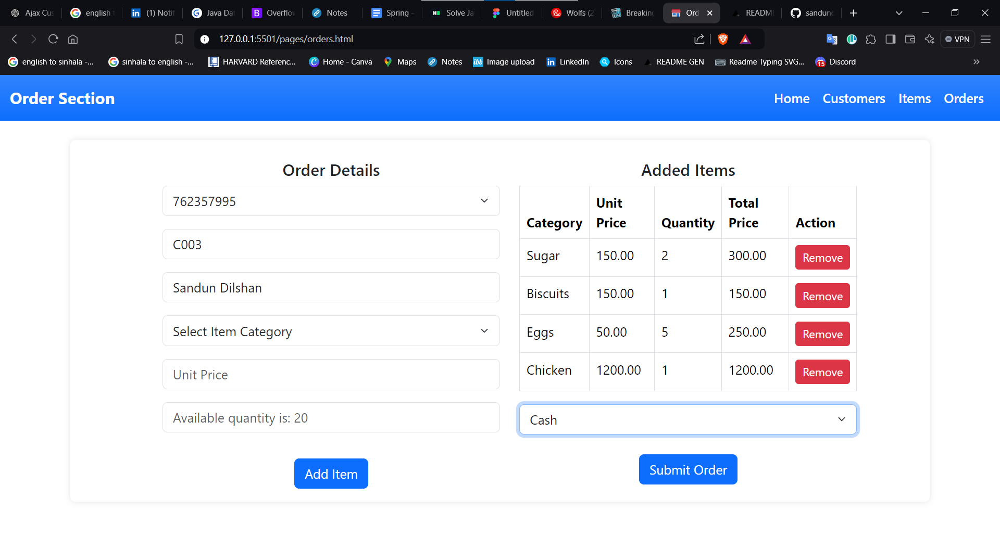
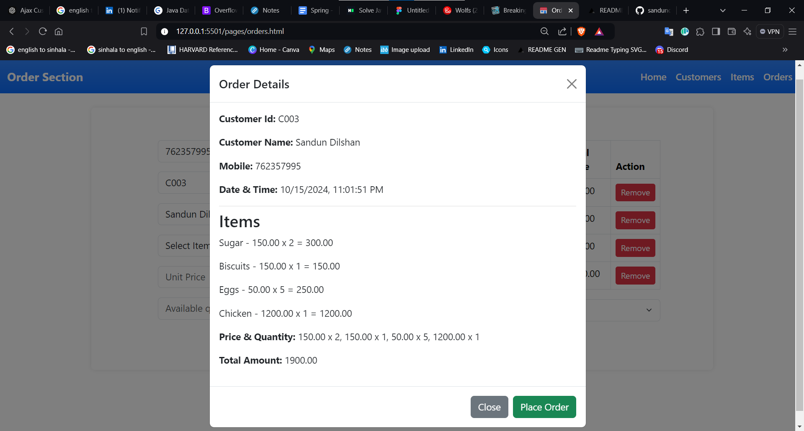
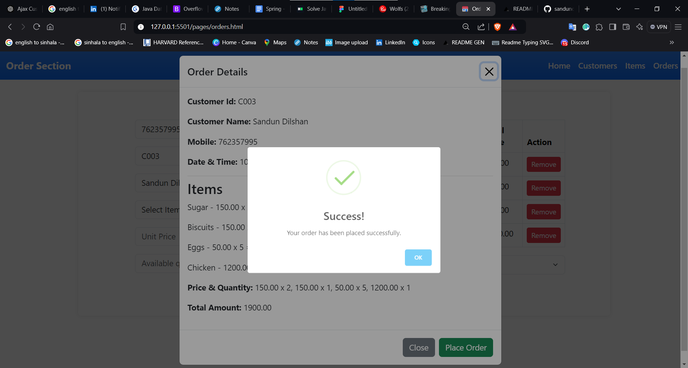

<a href="https://git.io/typing-svg"></a>

<p align="center"></p>

<p id="description">This repository contains the frontend code for the Spring POS system. It is built using HTML CSS JavaScript and integrates with a Spring backend to manage POS functionalities like customer orders inventory tracking and payment processing.</p>

<h2>Project Screenshots:</h2>











  
  
<h2>🧐 Features</h2>

Here're some of the project's best features:

*   Customer Management: Easily manage customer details and generate new orders.
*   Item Inventory: Add update and manage item stock in the POS system.
*   Order Management: Efficiently handle orders with real-time calculations for total cost and quantity.
*   Responsive UI: Optimized for mobile and desktop use ensuring a smooth user experience on any device.
*   Data Visualization: View stock levels and sales trends using chart integration.
*   Payment Methods: Supports various payment methods customizable for specific business needs.

<h2>🛠️ Installation Steps:</h2>

<p>1. Clone the repository:</p>

```
git clone https://github.com/sandundil2002/Spring_POS_Frontend.git
```

<p>2. Open index.html in your browser or use a local web server to run the project.</p>

```
http://127.0.0.1:5501/index.html
```

<h2>API Integration</h2>  

This frontend interacts with the Spring POS backend through the following API endpoints

  * /api/v1/customers - Retrieves and manages customer data
  * /api/v1/items - Fetches item list and stock levels
  * /api/v1/orders - Manages order placement and processing

<h2>Backend REST API Repository</h2>

  * For the backend implementation of this project, you can visit the repository <a href="https://github.com/sandundil2002/Spring_POS_API.git">Spring POS API</a>
  
<h2>💻 Built with</h2>

Technologies used in the project:

*   Frontend: HTML5 CSS3 JavaScript (jQuery Chart.js)
*   Backend Integration: REST API with Spring Framework

<h2>🛡️ License:</h2>

This project is licensed under the MIT License.
